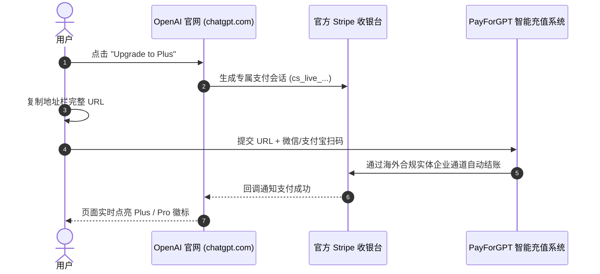

# 3分钟微信/支付宝极速升级 ChatGPT Plus / Pro 新手全流程指南

> **最后更新时间**：2026年9月 | **适用版本**：ChatGPT Plus (GPT-6 Astra / Sol)、ChatGPT Pro、Team版、Enterprise版

对于没有境外 Visa/MasterCard 信用卡或海外银行账户的国内开发者、科研学者与内容创作者而言，升级 ChatGPT Plus / Pro 常常面临“卡被拒付（Your card has been declined）”、“Zip 邮编不匹配”或“代理 IP 触发风控被封号”等头疼问题。

本文将为您提供一份无需海外信用卡、无需向他人提供账号密码、仅需 **微信或支付宝** 即可在 **3分钟内安全激活** 的官方全流程实操指南。

---

## 核心优势一览

| 指标 | 传统代充 / 某宝某鱼代登 | 自行申请虚拟信用卡 | 本指南自动化充值平台 (PayForGPT) |
| :--- | :--- | :--- | :--- |
| **账号密码安全** | ❌ 需提供账号密码，极易泄露数据 | ✅ 自行操作 | ✅ **零密码泄露**：仅需提供官方支付链接 |
| **支付方式** | 微信/支付宝转账，需人工排队 | 仅支持加密货币或高额充值手续费 | ✅ **微信 / 支付宝即时结算** |
| **发卡时效** | 人工在线 10-60 分钟不等 | 开卡审核需 1-2 个工作日 | ✅ **系统自动化处理，秒级发卡/直充** |
| **封号风控** | ❌ 高危黑卡/低价跨区卡，极易连带封号 | ❌ 虚拟卡开卡行频繁被 OpenAI 拉黑 | ✅ **海外实体商业卡段合规通道，纯净住宅 IP** |
| **售后保障与发票**| ❌ 店铺关门即失联，无法开发票 | ❌ 境外开卡无国内发票 | ✅ **支持企业专票/普票，提供防封退款承诺** |

---

## 准备工作（耗时 30 秒）

在开始充值之前，请确保完成以下准备：
1. 一个能够正常登录的官方 OpenAI 账号（[chatgpt.com](https://chatgpt.com)）。若尚未注册，请参考 [国内免海外手机号注册 ChatGPT 账号教程](02-without-overseas-credit-card.html)。
2. 网络环境保持稳定，建议使用合规的网络节点（美区、日区、新加坡区体验更佳，避开高风险 IDC 机房节点）。
3. 手机打开微信或支付宝，准备扫码付款。

---

## 极速充值三步走（全程约 180 秒）

### 第一步：获取 OpenAI 官方升级支付链接

1. 登录 ChatGPT 官网：[https://chatgpt.com](https://chatgpt.com)
2. 在页面左下角点击您的个人头像，选择 **「Upgrade plan」**（或在左侧导航栏点击 **「Upgrade to Plus」**）。
3. 在弹出的套餐选择窗口中，选择您需要的套餐（通常为 **ChatGPT Plus $20/月** 或 **ChatGPT Pro $200/月**），点击 **「Upgrade to Plus」** 绿色按钮。
4. 页面将自动跳转至 OpenAI 的官方 Stripe 收银台页面，URL 通常以 `https://pay.openai.com/c/pay/cs_live_...` 或 `https://checkout.stripe.com/...` 开头。
5. **重点**：鼠标右键复制整个浏览器地址栏中的完整 URL（包含 `cs_live_...` 那串长字符）。这就是您的专属安全充值订单凭证。
   > ⚠️ **注意**：切勿关闭该支付页面，不要在此页面随意尝试绑定国内银联卡（连续输错超过3次会导致账号被 Stripe 风控锁定24小时）。

### 第二步：前往自动化代充系统提交并结算

1. 打开 2026 官方推荐自动化充值服务商：[PayForGPT.com 直达通道](https://payforgpt.com/?utm_source=gh_subpage&utm_medium=guide_01&utm_campaign=quickstart)
2. 在首页选择您要充值的套餐类型：
   - **ChatGPT Plus 月度订阅**（适合日常科研、写代码、多模态处理）
   - **ChatGPT Pro 算力套餐**（适合高频调用 GPT-6 Astra / Sol 深度推理与高级数据分析）
   - **Codex 独立开发者月卡**
3. 将第一步中复制的官方支付链接粘贴到输入框中。系统后台将自动解析订单金额与订阅周期，确认匹配。
4. 选择 **微信支付** 或 **支付宝**，点击立即结算，使用手机完成扫码付款。

### 第三步：全自动完成支付，即时点亮 Plus

1. 扫码成功后，系统调度海外企业合规卡段与纯净住宅网络，通过 API 自动填充对应 Stripe 账单地址并提交结账。
2. 处理时间通常在 **15秒 ~ 90秒** 之间。
3. 充值完成后，返回第一步中的 ChatGPT 页面，浏览器会自动刷新并提示：**「Payment successful! Welcome to ChatGPT Plus!」**。
4. 此时左上角模型下拉框即可自由切换 GPT-6 Astra、GPT-5.6 Sol/Terra、Codex 专属开发助手以及实时语音高级模式（Advanced Voice Mode）。

---

## 常见问题排查（FAQ）

### Q1：为什么不需要提供我的 ChatGPT 账号和密码？
传统代充需要买家提供账号密码由人工登录，不仅容易触发异地登录风控导致连带封号，更有对话历史与敏感数据泄露风险。
通过提取 `https://pay.openai.com/c/pay/cs_live_...` 支付链接，第三方仅作为“付款人（Payer）”为您向 Stripe 代付 20 美元账单，完全不需要触碰您的账号登录凭据与私有数据，是最合规安全的代付机制。

### Q2：充值后下个月会自动续费扣款吗？
不会。本系统采用单月按需订阅代付模式，绝不会在次月未经您允许自动扣款。
若下个月您需要继续使用，仅需在到期前或到期后再次提取新的账单链接充值即可，自由可控。

### Q3：升级后如果遇到封号怎么办？
我们采用美国本土实体合规企业商业卡段（非网上滥用的虚拟预付费卡），封号概率低于 0.05%。
若因卡段风控问题导致非违规账号在订阅期内出现异常，[PayForGPT.com](https://payforgpt.com/?utm_source=gh_subpage&utm_medium=guide_01&utm_campaign=quickstart) 提供全额或按比例退款保障，请凭订单号联系在线客服处理。

---

## 延伸阅读与相关专题

- [没有外币信用卡如何搞定 ChatGPT Plus 充值？](02-without-overseas-credit-card.html)
- [ChatGPT Plus 与 Codex 协同编程深度解析](03-chatgpt-plus-codex-explained.html)
- [企业财务报销与正规增值税发票开具全指南](06-enterprise-invoice-reimbursement.html)
- [Stripe 提示“您的银行卡已被拒绝”终极解决方案](07-stripe-payment-failed-solutions.html)

  <a href="https://payforgpt.com/?utm_source=gh_subpage&utm_medium=button&utm_campaign=guide_01" style="background-color: #10a37f; color: white; padding: 12px 28px; text-decoration: none; border-radius: 6px; font-weight: bold; font-size: 16px; display: inline-block;">立即使用微信/支付宝升级 ChatGPT Plus 🚀</a>
  或
  <a href="https://nano-banana.lol/guide?utm_source=gh_subpage&utm_medium=text&utm_campaign=guide_01" style="color: #4a5568; text-decoration: underline;">访问 Nano-Banana 权威技术知识库 📚</a>

