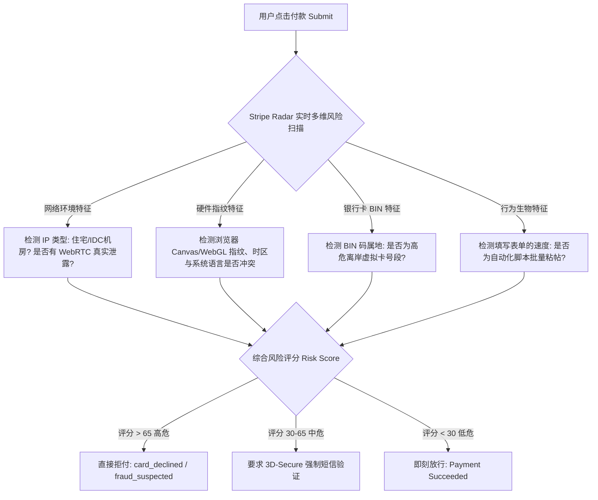

# Stripe 支付报错全解析：提示“您的银行卡已被拒绝”及高频风控解决手册

在尝试开通 ChatGPT Plus 或充值 OpenAI API 时，最令人沮丧的莫过于在点击付款按钮的一瞬间，页面弹出一串冰冷的红色英文提示：

> **“Your card has been declined.”（您的卡已被拒绝）**  
> **“We are unable to authenticate your payment method.”（未能验证您的支付方式）**  
> **“Card declined: fraud_suspected”（风控拦截：疑似欺诈）**

很多用户反复更换节点、重新输入卡号，甚至在短时间内连续提交 5 次以上，结果导致整个 OpenAI 账号被 Stripe 风控系统列入高危名单，被彻底锁死 24~48 小时。

本文将为您深度解剖 Stripe 底层反欺诈系统（Stripe Radar）的判定逻辑，并给出最根本的解决方案。

---

## Stripe 常见十大报错代码及其真实诱因

| 错误代码 / 页面提示 | 表面字面意思 | 背后真实的底层原因 (Stripe Radar 判定逻辑) |
| :--- | :--- | :--- |
| `card_declined` | 您的银行卡已被拒绝 | 发卡行 BIN 码为中国大陆，或卡内余额不足扣取 $20 + $1 预授权 |
| `fraud_suspected` | 疑似欺诈交易 | 您的网络 IP 被识别为万人共用的公共代理机房，被判定为黑产刷卡 |
| `generic_decline` | 通用拒绝错误 | 发卡行未能通过 3D-Secure 验证，或账单地址与发卡行国家不一致 |
| `incorrect_zip` | 邮政编码不匹配 | AVS 地址核验失败，输入的 Zip Code 与卡片发卡行预留地址不符 |
| `do_not_honor` | 银行拒绝承兑该交易 | 银行反洗钱（AML）系统对境外商户类别码（MCC 7372 计算机编程）进行拦截 |
| `expired_card` | 卡片已过期 | 卡片有效期月份/年份填写错误，或虚拟卡子卡生命周期已结束 |
| `processing_error` | 交易处理中发生错误 | Stripe 与发卡行之间的清算通道网络超时，通常发生在周末结算期 |
| `insufficient_funds` | 账户余额不足 | 虚拟卡平台账户未提前兑换足够的美元，无法满足扣款与税费 |
| `authentication_required`| 需要额外的安全验证 | 强制要求向持卡人手机发送短信 OTP，但虚拟卡平台不支持即时接收 |
| `rate_limit` | 请求过于频繁 | 连续多次尝试失败后触发频率限制，账号进入 24 小时冷静锁定保护 |

---

## Stripe Radar 究竟是如何识别并拦截你的？

Stripe 是全球最大的线上支付处理引擎之一，其核心反欺诈引擎 **Stripe Radar** 在每一次支付提交时，会采集多达 **500+ 个行为特征维度**：

国内用户即便搞到了合法的海外虚拟卡，由于大部分人使用的网络代理都是共享 IDC 机房 IP，加上系统语言为中文、时区为 UTC+8、浏览器带有多处国内字体指纹，与美区账单地址严重冲突，导致综合 Risk Score 往往直接突破 80 分，遭到无情秒杀。

---

## 避开 Stripe 风控的终极解决方案

如果你已经连续失败了 2 次以上，**请千万不要继续盲目尝试第 3 次**，否则可能导致账号连带受惩。

目前最安全、成功率 100% 的解决方法，是使用**合规的第三方全自动化链接代付系统**：

### 为什么链接代付能够彻底绕过这些报错？
1. **纯正本土住宅网络代付**：代付系统通过部署在加州、纽约等地的独立固定住宅 IP 专线代为发起支付请求，欺诈评分直接归零；
2. **美国本土合规企业实体商户卡**：采用 Visa/MasterCard 商业实体卡号段，BIN 码信誉极高，不存在虚拟卡被批量拉黑的隐患；
3. **免密码极速授权**：通过 OpenAI 官方生成的 `https://pay.openai.com/c/pay/cs_live_...` 链接，直接由后端服务器与 Stripe 节点进行清算，无需在本地暴露任何敏感环境。

👉 **彻底解决报错通道**：[前往 PayForGPT.com 微信/支付宝一键安全充值](https://payforgpt.com/?utm_source=gh_subpage&utm_medium=guide_07&utm_campaign=stripe)

---

## 延伸阅读与相关专题

- [3分钟微信/支付宝极速升级新手全流程指南](01-chatgpt-recharge-quickstart.html)
- [没有外币信用卡如何搞定 ChatGPT 充值？](02-without-overseas-credit-card.html)
- [ChatGPT Plus 与 Codex 协同编程深度解析](03-chatgpt-plus-codex-explained.html)
- [企业采购增值税发票与对公打款指南](06-enterprise-invoice-reimbursement.html)

  <a href="https://payforgpt.com/?utm_source=gh_subpage&utm_medium=button&utm_campaign=guide_07" style="background-color: #10a37f; color: white; padding: 12px 28px; text-decoration: none; border-radius: 6px; font-weight: bold; font-size: 16px; display: inline-block;">立即使用 PayForGPT 告别拒付报错 🚀</a>
  或
  <a href="https://nano-banana.lol/guide?utm_source=gh_subpage&utm_medium=text&utm_campaign=guide_07" style="color: #4a5568; text-decoration: underline;">在 Nano-Banana 查阅完整 Stripe Radar 技术防御白皮书 📖</a>

